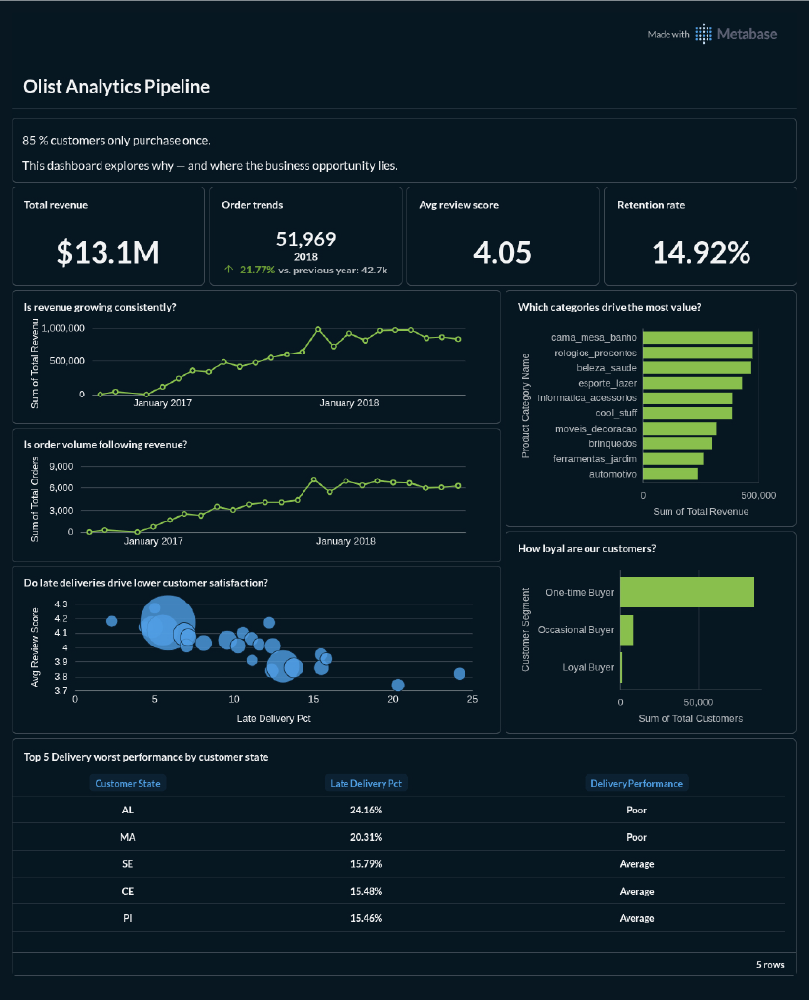
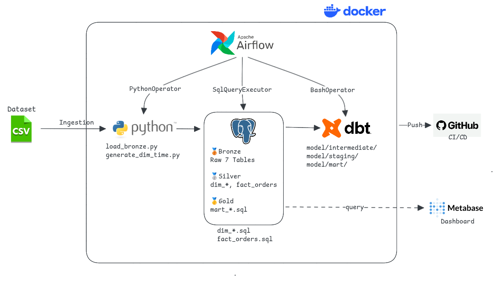
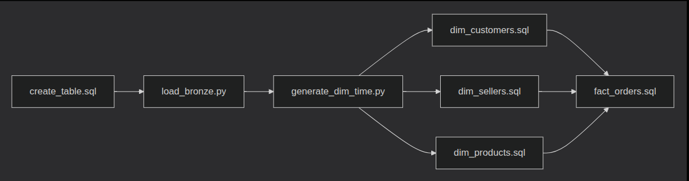

# Olist Analytics Pipeline


> 85% of Olist customers never come back. This pipeline finds out why.

A production-grade batch data pipeline built on the [Brazil Olist E-Commerce dataset](https://www.kaggle.com/datasets/olistbr/brazilian-ecommerce) — 100k+ orders across 2016–2018. Built to answer one business question: **what drives customer retention, and where is Olist losing it?**

---

## Table of Contents

- [Dashboard Preview](#dashboard-preview)
- [What This Pipeline Found](#what-this-pipeline-found)
- [Architecture](#architecture)
- [Key Engineering Decisions](#key-engineering-decisions)
- [Tech Stack](#tech-stack)
- [DAG Overview](#dag-overview)
- [Project Structure](#project-structure)
- [Quick Start](#quick-start)
- [Running Tests](#running-tests)
- [Dataset](#dataset)

---

## Dashboard Preview



Key metrics visible in the dashboard:
- $13.1M total revenue across 2016–2018
- 51,969 orders in 2018 (+21.77% YoY)
- 4.05 average review score
- 14.92% customer retention rate
- Late delivery hotspots: AL (24.16%), MA (20.31%)

## What This Pipeline Found

From the Metabase dashboard built on top of this pipeline:

- **Retention rate is only 14.92%** — 85 out of 100 customers never return
- **Late delivery correlates directly with lower review scores** — states with >20% late delivery rate (AL, MA) show avg review scores below 4.0 vs 4.2+ for on-time states
- **`cama_mesa_banho` dominates revenue** — top category by a wide margin, yet delivery performance in high-order states remains poor
- **Revenue grew 21.77% YoY** — order volume followed the same trend, suggesting healthy demand but a retention problem, not an acquisition problem

---

## Architecture



The pipeline uses a **Medallion Architecture** with three layers inside PostgreSQL, fully orchestrated by Airflow on Docker.

```
Source CSVs (Olist, 9 files)
        │
        ▼
┌───────────────────────────────────────┐
│           BRONZE LAYER                │
│   PostgreSQL schema: bronze           │
│   Raw ingestion via Python + pandas   │
│   7 tables, no transformation         │
└───────────────────────────────────────┘
        │  SQL transforms (dim + fact)
        ▼
┌───────────────────────────────────────┐
│           SILVER LAYER                │
│   PostgreSQL schema: silver           │
│   Star schema — surrogate keys        │
│   dim_customers, dim_sellers,         │
│   dim_products, dim_time,             │
│   fact_orders (grain: 1 order item)   │
└───────────────────────────────────────┘
        │  dbt (staging → intermediate → marts)
        ▼
┌───────────────────────────────────────┐
│           GOLD LAYER                  │
│   PostgreSQL schema: gold             │
│   5 mart tables — business aggregates │
│   mart_sales_daily                    │
│   mart_seller_performance             │
│   mart_product_category               │
│   mart_delivery_performance           │
│   mart_customer_segmentation          │
└───────────────────────────────────────┘
        │
        ▼
  Metabase Dashboard
```

All layers orchestrated by a single **Airflow 3.1.7 DAG** running on Docker.

---

## Key Engineering Decisions

**Why SQL for Bronze → Silver, not dbt?**

dbt is designed for transforming already-clean data — not raw ingestion. Bronze → Silver involves deduplication, surrogate key generation via PostgreSQL SEQUENCE, and MERGE-based idempotent loading.

**Why idempotent loading?**

Every task in the DAG can be re-run safely without duplicating data. Bronze uses TRUNCATE + append. Silver uses `NOT EXISTS` checks and `MERGE` statements. This means a failed DAG run can always be retried without manual cleanup.

**Why dbt for Silver → Gold?**

Silver is clean and structured. Gold is pure business logic — aggregations, window functions, rankings. dbt's `ref()` system handles dependency resolution automatically, and `dbt test` validates the output at every run. This is exactly the use case dbt was built for.

**Why star schema in Silver, not just flatten everything?**

Surrogate keys in dimension tables decouple the fact table from natural key changes. A customer's `customer_id` in Olist is per-order — not per-customer — so using `customer_unique_id` as the business key while maintaining a separate surrogate key is a deliberate modeling decision that prevents downstream join issues.

---

## Tech Stack

| Layer | Tool |
|---|---|
| Ingestion | Python 3.12, Pandas |
| Storage | PostgreSQL 15 |
| Transformation | SQL (Bronze→Silver), dbt-postgres (Silver→Gold) |
| Orchestration | Apache Airflow 3.1.7 |
| Containerization | Docker |
| Dashboard | Metabase |
| Testing | pytest, dbt test |
| CI/CD | GitHub Actions |

---

## DAG Overview



The DAG runs sequentially from schema creation through to dbt testing, with dimension tables loading in parallel to reduce runtime.

Dimension tables (`dim_customers`, `dim_sellers`, `dim_products`) load in parallel after `dim_time` is ready. `fact_orders` waits for all three dimensions before loading — enforcing referential integrity at the DAG level, not just the database level.

---

## Project Structure

```
olist-analytics-pipeline
├── arsitektur.md
├── config
├── dags
│   └── ecommerce_dag.py
├── data
│   └── raw
├── dbt
│   ├── dbt_packages
│   ├── dbt_project.yml
│   ├── logs
│   ├── models
│   ├── package-lock.yml
│   ├── packages.yml
│   ├── profiles.yml
│   ├── target
│   └── tests
├── docker-compose.yml
├── Dockerfile
├── docs
│   ├── Architecture.png
│   ├── DAG.png
│   └── Dashboard.png
├── README.md
├── scripts
│   ├── __init__.py
│   ├── load_bronze.py
│   └── generate_dim_date.py
├── sql
│   ├── bronze
│   ├── gold
│   ├── schema
│   └── silver
└── tests
    ├── conftest.py
    ├── test_generate_dim_time.py
    └── test_load_bronze.py
```

---

## Quick Start

**Prerequisites:** Docker, Docker Compose, Git

```bash
# Clone
git clone https://github.com/YOUR_USERNAME/olist-analytics-pipeline.git
cd olist-analytics-pipeline

# Download dataset from Kaggle and place CSVs in data/raw/
# https://www.kaggle.com/datasets/olistbr/brazilian-ecommerce

# Setup environment
cp .env.example .env
# Edit .env with your credentials

# Start all services
docker compose up --build

# Trigger pipeline
# Open Airflow at localhost:8080 → trigger DAG: ecommerce

# Open dashboard
# Open Metabase at localhost:3000
```

---

## Running Tests

```bash
# Unit tests
pytest tests/ -v

# dbt tests (inside container)
docker exec -it airflow bash -c "cd /opt/airflow/dbt && dbt test --profiles-dir /opt/airflow/dbt"
```

---

## Dataset

[Brazilian E-Commerce Public Dataset by Olist](https://www.kaggle.com/datasets/olistbr/brazilian-ecommerce) — 100k orders from 2016–2018, published under CC BY-NC-SA 4.0.
